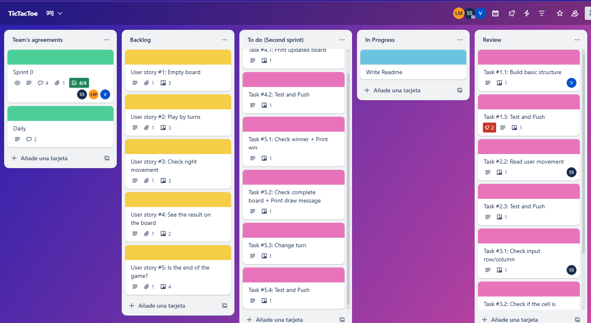

# 🎮 Tic Tac Toe

We developed a terminal-based version of the classic game Tic Tac Toe. This is a backend project in Java 21 built collaboratively using agile methodologies.

## 📌 Project Objectives

Implement the core logic of the Tic Tac Toe game in a terminal interface, following the game’s rules:

- Two players: X and O  
- Player X starts the game  
- Played on a 3x3 grid  
- A player wins by aligning three matching symbols in a row, column, or diagonal  
- If all cells are filled without a winner, it’s a draw  
- The board is displayed after each turn  
- At the end, a message is shown indicating the winner or a draw

  

## 🧠 Technical Skills

- Backend development in Java
- Object-Oriented Programming (OOP)
- Control flow (conditionals and loops)
- Multidimensional array handling
- User input via `Scanner`
- Unit testing 

## 💻 Technologies Used

- Java 21
- JUnit (for testing) 

## 🛠 Tools

- IntelliJ IDEA
- Git & GitHub (with GitFlow)
- Trello (for agile project management)
- Figma (for flow chart design) 

## 🧪 Testing

Basic unit tests are included to verify the game logic:

✅ Win condition validation 
✅ Draw detection 
✅ Occupied cell validation 

Tests can be executed using **JUnit**. 

## 📋 Functional Requirements

- [x] Display the empty board at the start
- [x] Show the current board after each move
- [x] Allow moves via row and column input
- [x] Validate if the selected cell is already occupied
- [x] Check for a winner after each move
- [x] Detect draw when all cells are filled without a winner
- [x] Show a message declaring the winner or a draw
- [x] Include unit tests
- [x] Follow **GitFlow** workflow 

## 📓 Non-Functional Requirements

- Terminal-based (console) user interface
- Follows Java best practices and conventions
- Clean, readable, and well-named code (classes, methods, variables) 

## 🔄 Project Workflow

This project is organized into **2 sprints**, developed collaboratively using **agile methodologies**.  
The team manages tasks and user stories using **Trello** board.

 

## 🤝 Team members

This project was developed as a **team exercise** to practice team collaboration, software engineering best practices and modern development tools and workflows by:

- [Sofía Santos García](https://github.com/sofianutria)
- [Vita Poperechna](https://github.com/VitaPoperechna)
- [Lara Pla Moreno](https://github.com/Lizar22)

